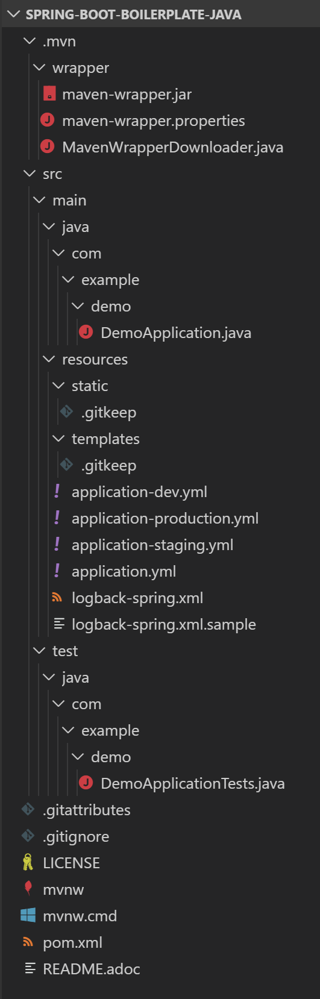

= Spring Boot 样板项目（使用Java与Maven）

本样板项目基于 https://spring.io/[Spring] 官方的 https://start.spring.io/[Spring Initializr] 生成的 https://spring.io/projects/spring-boot/[Spring Boot] 项目，
并添加一些实用的常见配置，便于在新项目启动时“简单修改POM即可复用”。

同时，本项目也将不断跟进上游最新版本，以便下游项目一站式更新。

== 项目信息

* 构建工具：Maven
* Java 版本：11

与 https://start.spring.io/[Spring Initializr] 生成的 https://spring.io/projects/spring-boot/[Spring Boot] 项目相比，有如下变动：

* git 行为配置
** 一个通用的 `.gitignore` 文件（规定 git 自动忽略哪些文件）
** 一个通用的 `.gitattributes` 文件（规定 git 对文本格式的处理）

* Maven 仓库使用【阿里云】中国大陆的镜像，改善下载速度

* 包含一个基本的 `README.adoc` 自述文件，以便参考 AsciiDoc 语法
** AsciiDoc 兼容 Markdown 语法，直接写 Markdown 也 OK

* 配置文件使用YAML （ `application.yml` 取代 `application.properties` ）

* 项目配置集
** 三个 Maven Profile: `dev`, `staging`, `production`
** 三个 Spring Profile: `dev`, `staging`, `production`
** 注意两者的作用域不同，此处只是为了便于项目管理而使用了一致的名字

* Logback 日志配置 `logback-spring.xml`
** 默认根据 Profile 选用控制台输出／文件输出（简单配置）
** 附带样例文件，方便详细配置：
*** `logback-spring.xml.file.sample` 文件输出（详尽配置）
*** `logback-spring.xml.jdbc.sample` 数据库输出（JDBC）
*** `logback-spring.xml.aliyun.sample` 阿里云SLS（阿里云日志服务）

== 运行指引

* 如果你使用 IDEA / Spring Tool Suite，直接运行项目即可。

如果你不想使用 IDE，可以用命令行的方式运行 Spring Boot 项目，你需要先在本地安装：

* Git
* Java

执行命令：
[source,sh]
----
git clone https://github.com/yanwenkun/spring-boot-boilerplate-java.git
cd spring-boot-boilerplate-java
./mvnw clean spring-boot:run
----

按 `Ctrl + C` 终止运行

== 关于配置集

* Profile 直译即“档案”，此处理解为配置、配置集

* 本项目中的 三个 Profile 是有意选择的单词，长度递增：
** 开发阶段： `dev`
** 验证阶段： `staging`
** 生产阶段： `production`

=== Staging

* staging 翻译成“验证阶段”
** 如果翻译成“测试阶段”，流程上太靠前
** 如果翻译成“预发布阶段”，流程上太靠后
** “验证”更为概括而居中。本项目中仅包含这一中间阶段，如有需要可以再添加细分
** 理解 Staging 阶段在敏捷开发中的意义： http://www.shuker.top/technology/devops/deployments-best-practices/

=== Profiles

* 在本项目中有两种 Profile：
 1. Spring Profile
 2. Maven Profile

* 为了便于统一管理，本项目中 Spring Profile 和 Maven Profile 共用同一套名称，并且对两者进行了关联
** 比如， Maven 启用了 `staging` ， Spring 也会启用 `staging`
* 如果配置不当，这两种 Profile 可能会冲突
** 同一时间只能有一个 Spring Profile 激活
** 同一时间可以有多个 Maven Profile 激活（在本项目中不推荐这么做）

=== Profile 用法

* Spring Profile 在 Java/Kotlin 代码中的用法：
** 使用Spring注解： `@Profile("staging")`

* Maven Profile 不关心 Java 代码中的注解，只关心编译资源

=== 取舍

* 开发、验证、生产
 1. 既是软件生命周期中的“阶段”
 2. 也是运维与软件治理中的“环境”
* 这是一个“偷懒”的做法，将阶段和环境合为一谈，主要目的在于减少心智负担
** 但扩大开发规模的时候，还是要注意概念上的区分

=== 更多

* Maven 与 Spring 共用 Profile name 并不是高枕无忧的设计
** 主要看 Profile 是否与自动化流水线能够流畅配合
* 如果不需要 Maven 根据环境／阶段管理不同的依赖，可以不在 `pom.xml` 中定义 `Profiles`
* 使用环境变量，可以使 Spring Boot 程序运行时直接调用不同配置集：

[source,sh]
----
export SPRING_PROFILES_ACTIVE=production
----

